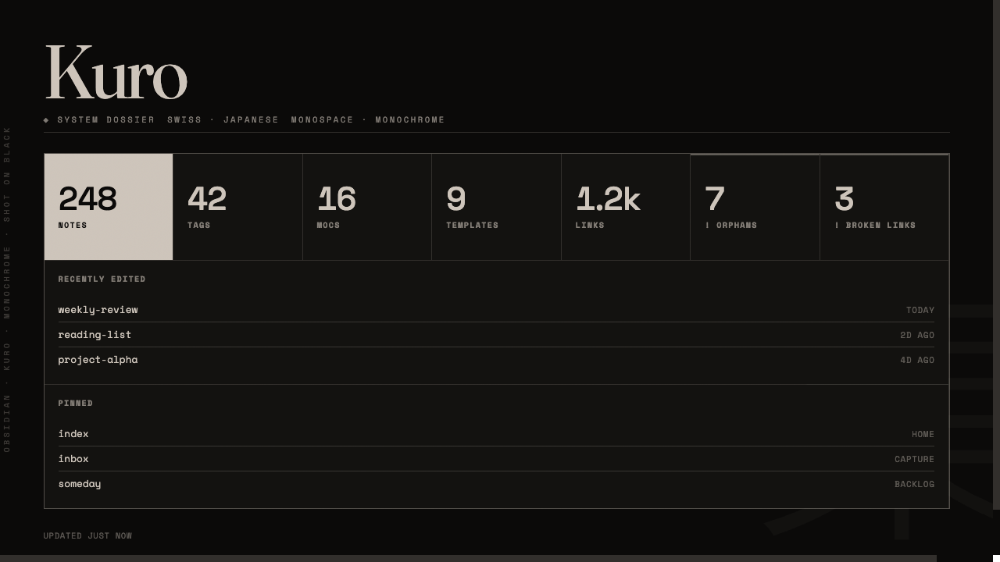

# Kuro

A Swiss-Japanese, monospace-first theme for Obsidian. Warm bone ink on near-black, hairline rules, near-sharp corners, and no accent colour: hierarchy comes from ink opacity and thin lines, never from hue. Ships with light ("paper") and dark ("black") modes.

## Design

- Monochrome warm palette: bone `#cdc4ba` on `#0b0a09` (dark); warm ink on `#ece7dd` paper (light).
- Three type roles: Fraunces (display H1), Space Grotesk (interface, H2), Space Mono (body, labels, code).
- Hairline rules, 2px corners, no shadows, and mono-uppercase "system" chrome (tabs, status bar, table headers, properties, tags).

Inspired by the visual language of [ryoku.dev](https://ryoku.dev). Kuro is an independent homage and is not affiliated with that project.

## Fonts and network use

Kuro loads Fraunces, Space Grotesk, and Space Mono from Google Fonts via CSS `@import` (all under the SIL Open Font License). This makes one network request to `fonts.googleapis.com` on load. If you prefer no remote requests, you have two offline options:

- Style Settings: Kuro → "Use installed vault fonts" (falls back to your own installed fonts), or
- install the three families locally on your system.

The theme degrades gracefully to system serif/sans/mono if the fonts are unavailable.

## Install

Manual (until listed in the community directory):

1. Download `manifest.json` and `theme.css` from the latest release.
2. Put them in `<your vault>/.obsidian/themes/Kuro/`.
3. Settings → Appearance → Themes → select "Kuro".

For the authentic fonts, clear the three font boxes in Settings → Appearance (Interface / Text / Monospace), or leave them and use the "Use installed vault fonts" toggle instead.

## Style Settings

With the Style Settings plugin installed, Kuro exposes:

- **Readable body font (sans)**: swap the Space Mono body for Space Grotesk on long reads.
- **Use installed vault fonts**: offline fallback to your own fonts.
- **Monospace headings**: render H1 in Space Mono instead of the Fraunces wordmark.
- **Full immersive**: pure black, higher-contrast ink, tighter spacing.
- **Paper grain**: faint film grain (on by default).
- **Ink tone**: Bone / Ash / Sand.
- **Corner radius**: 0 to 12px.

## Optional: dashboard "system dossier"

Kuro ships an optional homepage look (large serif wordmark, mono meta strip, hairline stat grid, ledger rows, kanji watermark, vertical margin text). This is a CSS snippet plus a note class, not part of the theme itself.

1. Copy `examples/dashboard.css` into `<vault>/.obsidian/snippets/`, then enable it (Settings → Appearance → CSS snippets).
2. Add `cssclasses: [dashboard]` to a note's frontmatter. See `examples/Dashboard-example.md` for the markup.
3. Pairs well with the Homepage plugin to open it on launch.

Snippet toggles (Style Settings → Kuro · Dashboard): kanji watermark, vertical margin text.

## License

MIT. See [LICENSE](./LICENSE).
